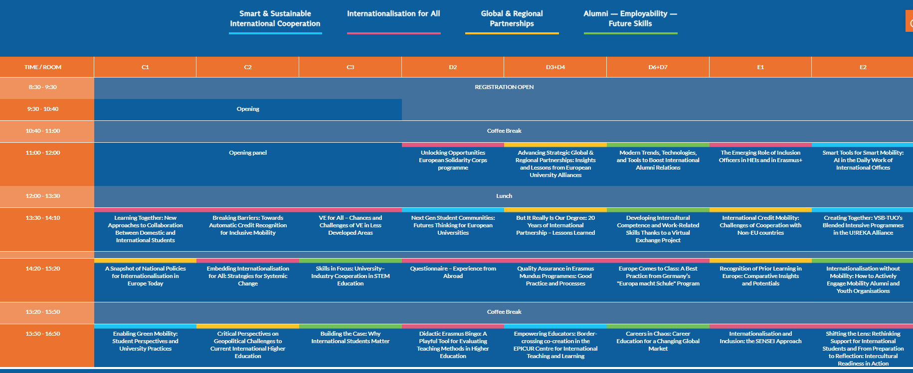
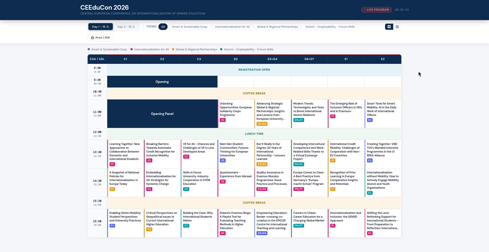

# CEEduCon 2026 - Live Program

Responzivní webová aplikace pro zobrazení konferenčního programu. Projekt vznikl jako součást výběrového řízení na pozici Webmaster/ka pro DZS.

Cílem nebylo kopírovat existující design, ale navrhnout řešení, které umožní rychlou orientaci v programu, bude dobře fungovat na desktopu i mobilu a bude snadno rozšiřitelné a editovatelné bez nutnosti zásahu do kódu.

---

## Jak nad řešením přemýšlím

Program konference musí být na první pohled čitelný a odpovídat na tři základní otázky, které si účastník klade:

- **„Co se děje teď?"**
- **„Kam mám jít?"**
- **„Co mě zajímá?"**

Zároveň jsem chtěl, aby aplikace působila více interaktivně, ne jen jako tabulka zkopírovaná z Excelu. Proto jsem přidal živé hodiny, zvýraznění aktuálního časového bloku a modální okno s detailem přednášky (v detailu se může zobrazovat víceméně jakkákoli doplňující info).

---

## Struktura projektu

```
/
├── index.html          # Kostra stránky, HTML struktura
├── css/
│   └── style.css       # Veškeré styly včetně responzivity a tisku
├── js/
│   ├── script.js       # Stav aplikace, filtry, přepínání dnů, hodiny
│   ├── render.js       # Renderování mřížky (grid) a karet (list)
│   └── modal.js        # Logika modálního okna
└── data/
    └── data.json       # Zdrojová data programu
```

Záměrně jsem rozdělil soubory do tří vrstev podle odpovědnosti. `data.json` drží veškerá data a je tedy nahraditelný jinými daty, `css a html`  řeší pouze vzhled stránky, `js` je dále také rozdělen do několika vrstev podle toho za co odpovídají. Díky tomu je každá část srozumitelná sama o sobě a snadno upravitelná bez rizika, že se rozbije zbytek.

---

## Hlavní rozhodnutí a jejich zdůvodnění

### Data oddělená od kódu

Celý program je v `data.json`. Každá session obsahuje čas, místnost, název a téma (track). Editace programu znamená otevřít JSON, změnit text a uložit - zvládne to i kolega bez znalosti JavaScriptu. Přidání nového dne znamená přidat jeden objekt do pole `days`.

Tato struktura také umožňuje napojení na CMS - WordPress REST API. Nebo jiný zdroj dat.

### Grid jako základ layoutu pro desktop

CSS Grid přirozeně odpovídá mentálnímu modelu programu: sloupce jsou místnosti, řádky jsou časové sloty. Umožňuje přesné zarovnání session a dobře se rozšiřuje o další místnosti nebo časové bloky.

### Dvě zobrazení (grid + list)

Grid je přehledný na desktopu - vidíte najednou celý den a snadno porovnáte, co se děje paralelně. Na mobilech pod ~768 px grid ztrácí čitelnost, proto se automaticky přepne na list view - karty seskupené podle času jsou na dotykové obrazovce přirozenější a přehlednější. Přepínač nechávám i uživateli samotném, protože různí lidé preferují různý způsob orientace.

### Barevné kódování témat

Každý track (Smart, Intl, Global, Alumni) má vlastní barvu definovanou na jednom místě (`TRACK_META` v `script.js`). Barva se automaticky propaguje do legendy, filtračních tlačítek, buněk v gridu i modálního okna. Změna barvy stojí jeden řádek kódu.

### Filtry jako toggle

Kliknutí na aktivní filtr ho vypne a vrátí zobrazení na „Vše". Ostatní přednášky nezmizí - jen ztmavnou (`dimmed`). Uživatel tak nikdy neztratí orientaci v čase a místnostech a zároveň přehledně vidí jen to co ho zajímá zrovna nebo to co hledá.

---

### Co by se dalo upravit/přidat?

**Přepínání dnů** ve stylu kalendáře (šipky, dnešní datum zvýrazněno). Optimalizováno pro více dnů.

**Live program** „Live program" badge funguje jako tlačítko - přepíná viditelnost aktuální časové lajny

**Napojení na CMS.** Data programu lze servírovat přes WordPress REST API. Editace programu pak probíhá přímo v administraci WP bez nutnosti sahat do kódu nebo JSON souboru.

**Osobní program.** Uživatel si kliknutím označí přednášky, které ho zajímají. Výběr se uloží do `localStorage` a zobrazí se jako samostatný filtr „Moje přednášky".

**Export do kalendáře.** Vygenerování iCal souboru ze zvolených přednášek pro import do Google Calendar nebo Outlooku.

---

## Spuštění lokálně

Protože `data.json` se načítá přes `fetch`, je potřeba lokální server (přímé otevření `index.html` v prohlížeči fetch zablokuje kvůli CORS).

```bash
# Python 3
python -m http.server 8000

```

Pak otevřete `http://localhost:8000`.

---


| Před | Po |
| :---: | :---: |
|  |  |
